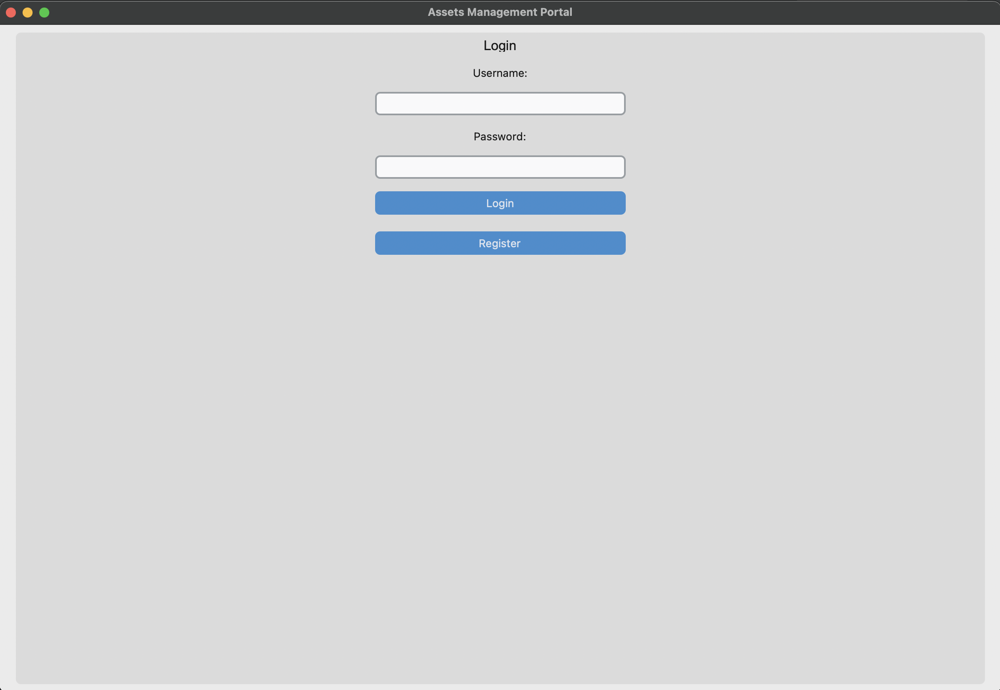
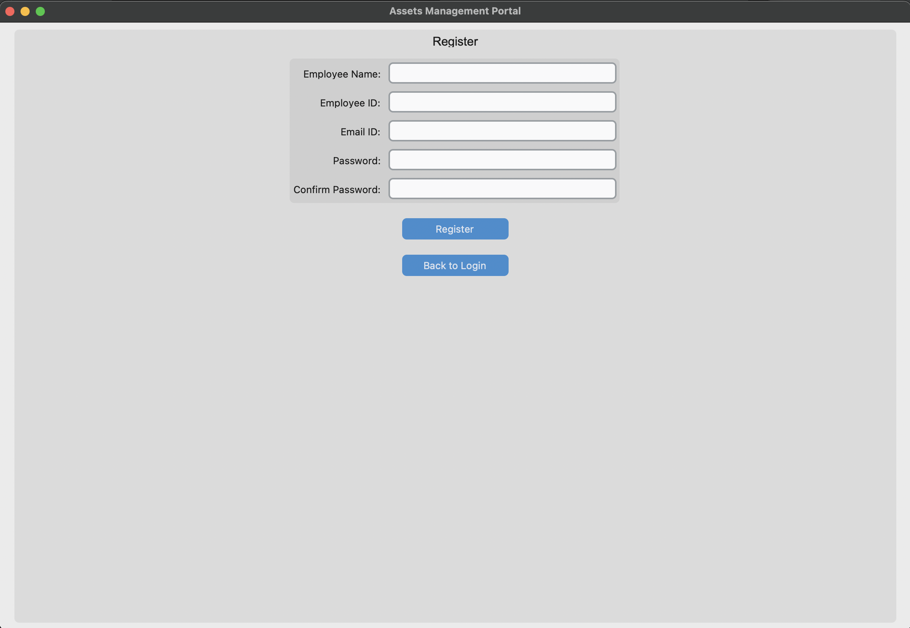
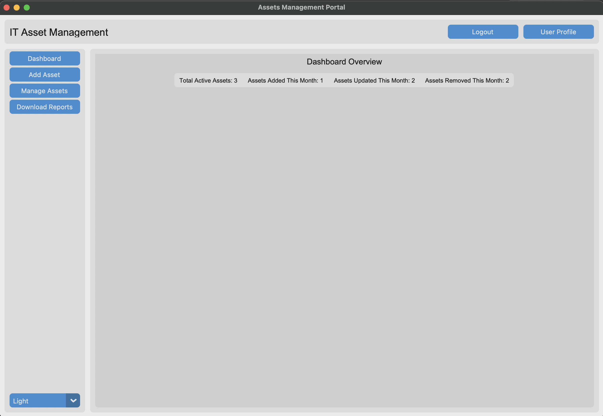
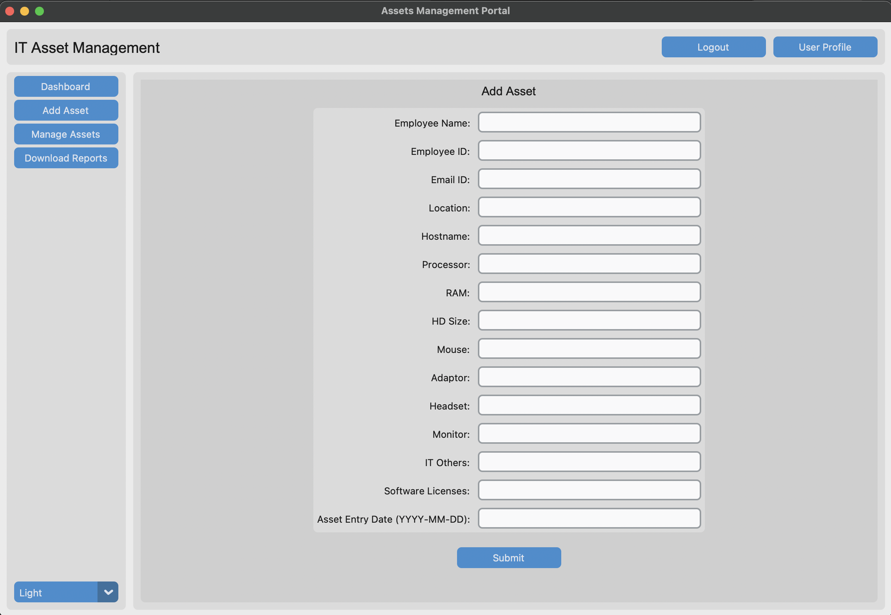
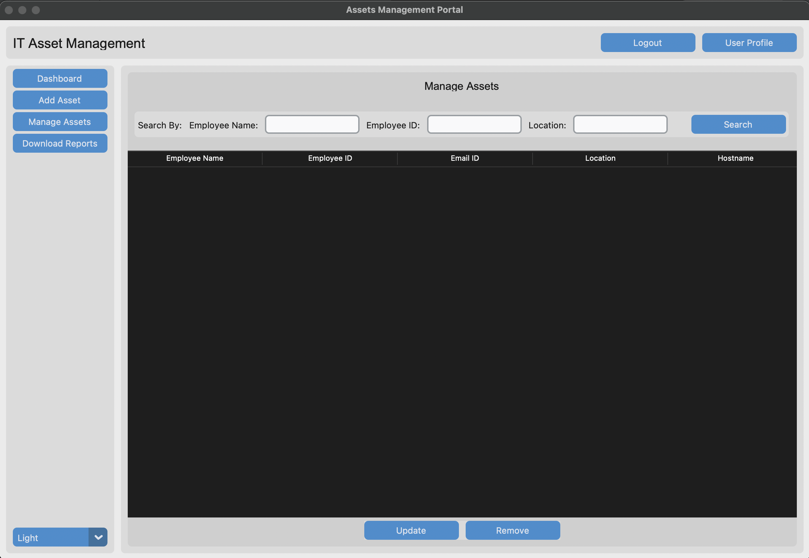
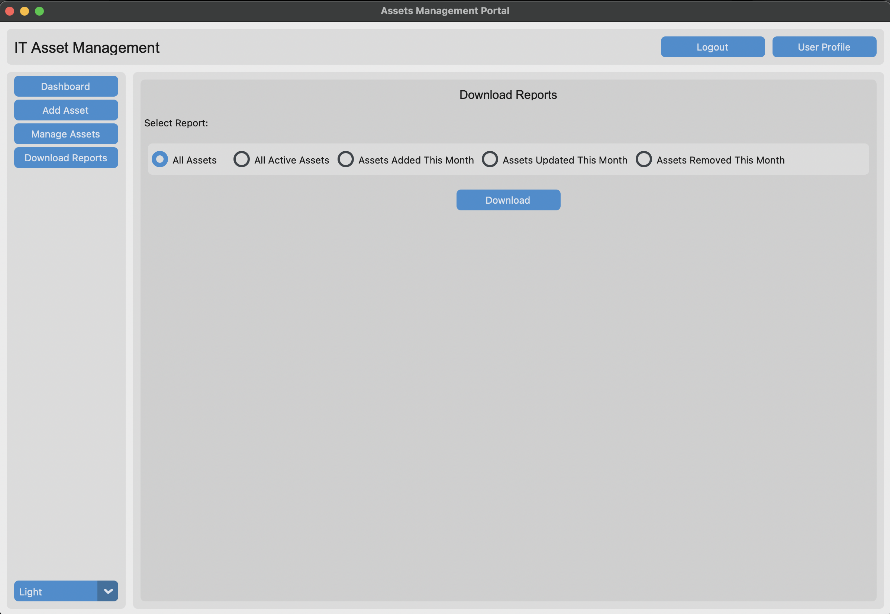

# Asset Management Portal

## Description
The Asset Management Portal is a comprehensive application designed to manage and track assets within an organization. It provides features for adding, removing, updating, and downloading asset details, along with robust user authenticationand a detailed dashboard for key metrics.

## Features
- **User Authentication**: Secure login and registration system.
- **Asset Management**: 
  - Add, remove, update, search, and filter assets.
  - Track asset details such as employee name, employee id, employee email id, location etc.
- **Dashboard**:
  - Total assets, Assets added this month, Assets updated this month and Assets removed this month.
- **Reports**: Downloadable asset reports.


## Screenshots

### Login Screen


### User Registration


### Dashboard


### Add Asset


### Manage Assets


### Download Reports



## Installation

### Prerequisites
- Python 3.9
- PostgreSQL

### Dependencies
Install the required Python packages:
- tkinter
- psycopg2
- bcrypt
- customtkinter
```bash
pip install -r requirement.txt
```


## Database Setup
1. Set up a PostgreSQL database.

## Configuration
Update the database connection parameters in the source code:

```python
self.conn = psycopg2.connect(
    host="your_host",
    database="your_database",
    user="your_user",
    password="your_password"
)
```

## Usage

Run the script to start the application:
```bash
python asset_management_portal.py
```
